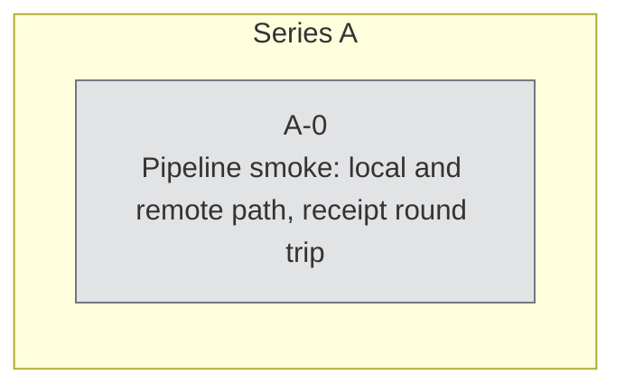

# Experiment log

Generated by `make log` from every `experiment.toml`. Do not edit by hand.
Verdict and summary are written in the manifest after reading the receipt.

## Series A

Premise: `experiments/A/PREMISE.md` <One sentence naming the estimand and the construction. Every experiment that serves this question is A-N, however different its design. Replacing this question opens series B; A stays as the record of the rejected or completed one.>

| id | status | tier | verdict | summary | relations |
|---|---|---|---|---|---|
| [A-0](./A/A-0-smoke/) | registered | smoke | ⏳ pending |  |  |

## Graph

Nodes are experiments grouped by series; edges are the declared relations
(solid: extends/motivates, dotted: controls, cross: contradicts, thick: reproduces).

